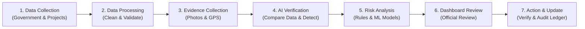
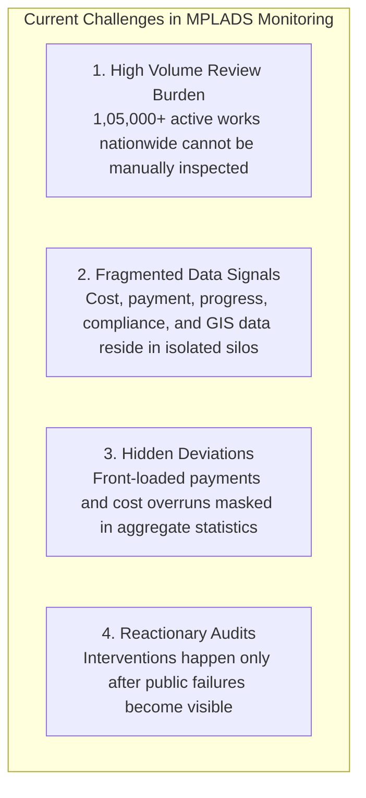
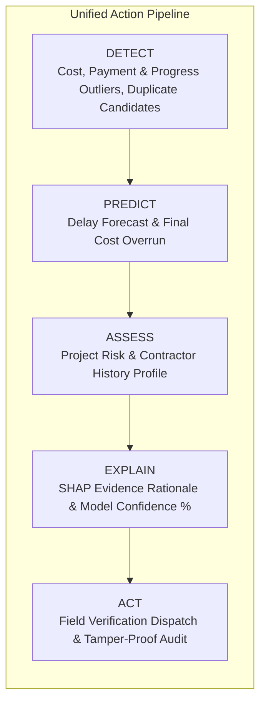
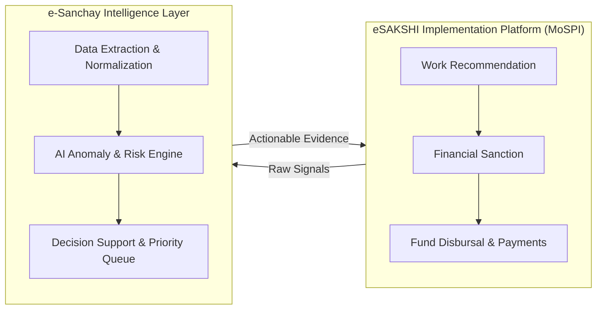
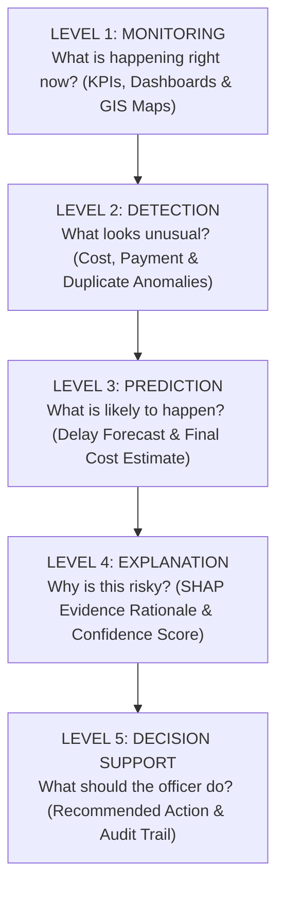
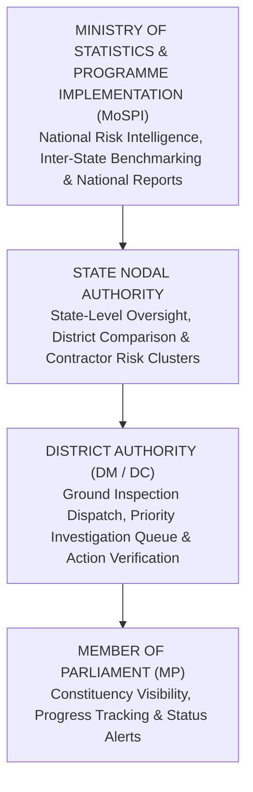
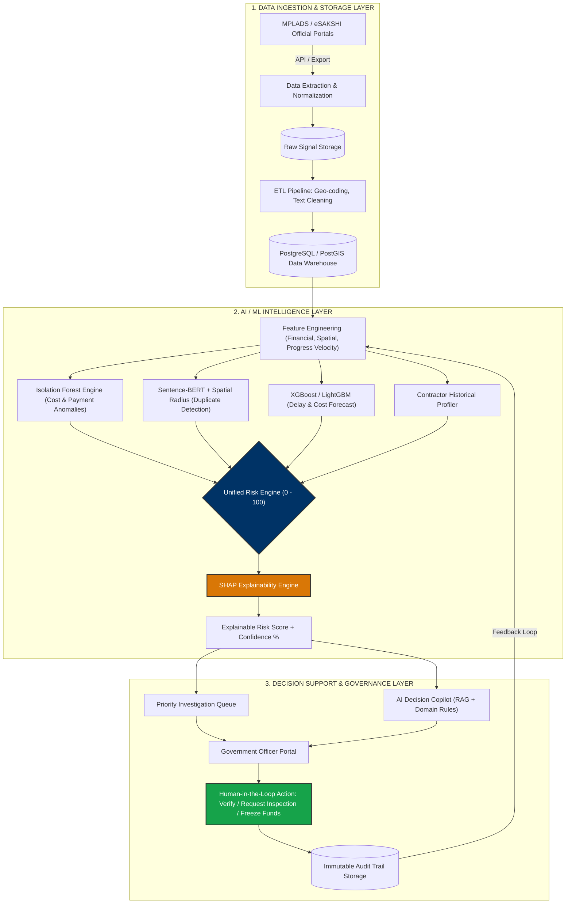
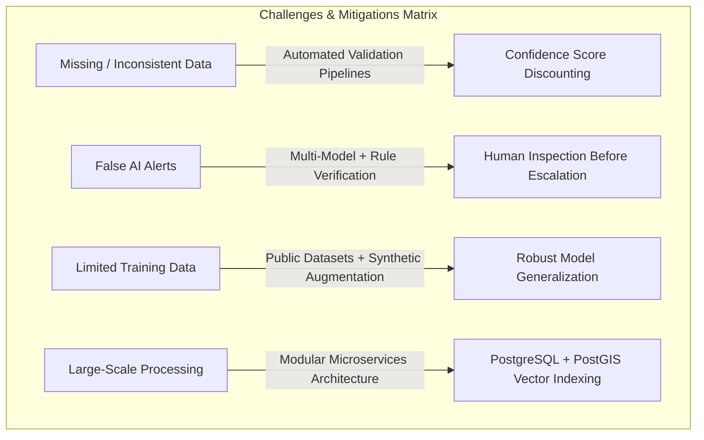
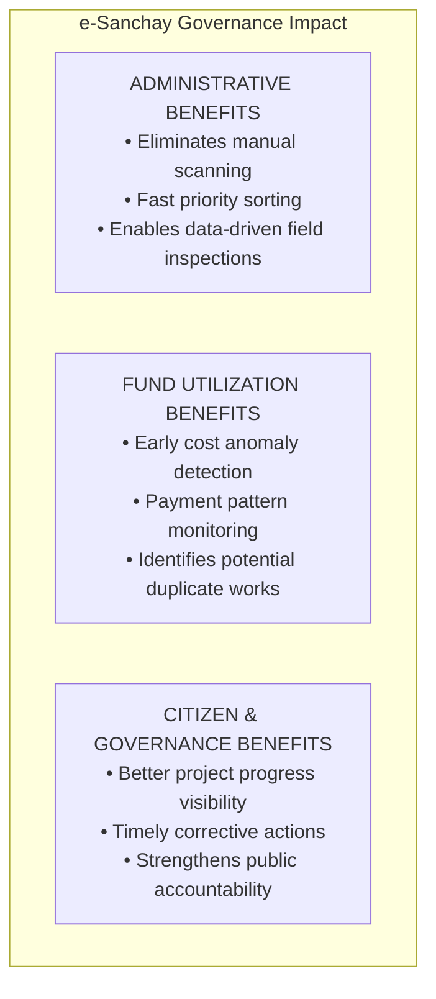

# e-Sanchay | MPLADS AI
### *Smart Monitoring & Risk Intelligence Platform for Members of Parliament Local Area Development Scheme (MPLADS)*

**Smart India Hackathon (SIH 2026)** | **Problem Statement ID**: 26102 | **Theme**: Smart Automation | **Category**: Software | **Team**: The Alchemists

[](LICENSE)
[](https://reactjs.org/)
[](https://nextjs.org/)
[](https://www.typescriptlang.org/)
[](https://www.python.org/)
[](https://fastapi.tiangolo.com/)
[](https://www.postgresql.org/)
[]()
[](https://mpladss.vercel.app)
[](https://youtube.com/watch?v=your-demo-id)

---

> **"We don't just monitor MPLADS works. We identify what needs attention, explain why, predict what could go wrong, and help authorities act before it becomes critical."**

---

## Executive Summary

**e-Sanchay (MPLADS AI)** is an enterprise-grade AI-powered monitoring, risk intelligence, and decision-support platform engineered for the **Ministry of Statistics and Programme Implementation (MoSPI), Government of India**.

Across India, over **1,05,000+ MPLADS works** are active at any given moment. No government authority can manually inspect every work. **e-Sanchay** converts raw, fragmented signals (project progress, fund releases, payment timing, compliance documentation, geo-location, contractor history) into a **single prioritized, explainable action pipeline**.



---

## Quick Links & Domain References

| Resource | Official Link | Description |
| :--- | :--- | :--- |
| **Live Web App** | [mplads-ai.vercel.app](https://mplads-ai.vercel.app) | Interactive Government-Enterprise Web Application |
| **YouTube Video Demo** | [Watch Video Demo](https://youtube.com/watch?v=your-demo-id) | End-to-End System Walkthrough |
| **eSAKSHI Dashboard** | [mplads.mospi.gov.in/digigov](https://mplads.mospi.gov.in/digigov/dashboard.html) | MoSPI eSAKSHI Official Public Dashboard |
| **MPLADS Official Portal**| [mplads.gov.in](https://www.mplads.gov.in/) | Official Government Source of Record |
| **MoSPI Annual Report** | [mospi.gov.in](https://mospi.gov.in/) | Annual Report on Scheme Implementation |
| **PIB Updates** | [pib.gov.in](https://pib.gov.in/) | Official Guidelines & Policy Updates |
| **CAG Audit Reports** | [cag.gov.in](https://cag.gov.in/) | Comptroller & Auditor General MPLADS Audits |

---

## Today's Reality & The Problem Statement

MPLADS involves large-scale works and fund transactions, making it difficult for authorities to manually detect delays, cost overruns, duplicate works, and unusual fund utilization.



---

## Capability Matrix: e-SAKSHI (Existing) vs. e-Sanchay (Proposed)

| Capability Domain | e-SAKSHI (Existing Platform) | e-Sanchay (Proposed Intelligence Layer) |
| :--- | :--- | :--- |
| **Project Management** | Recommends, sanctions, and tracks works transactionally | Uses existing project data to analyze multi-dimensional risks |
| **Fund Monitoring** | Tracks raw expenditure amounts and payment vouchers | Detects unusual fund utilization patterns & front-loading spikes |
| **Progress Monitoring** | Captures real-time milestone status entries | Predicts completion delays and cost inflation risk in advance |
| **Anomaly Detection** | Static data tables and manual report checking | Automated ML-based multi-variable anomaly detection |
| **Duplicate Works** | Stores basic project titles and descriptions | Semantic similarity (S-BERT) + geospatial radius detection |
| **Risk Assessment** | Basic status tags (Ongoing, Completed, Delayed) | Dynamic 0 - 100 Unified Risk Index with model confidence % |
| **Decision Support** | Static reporting dashboards | Explainable alerts + evidence rationale + priority action queue |

---

## Key Innovations & System Capabilities



1. **Multi-Dimensional AI Analysis**: Combines Financial + Spatial + Temporal + Progress data into a single **Unified Risk Score (0 - 100)**.
2. **Contractor / Agency Risk Intelligence**: Tracks persistent risk profiles across all works awarded to a single contractor (recurring delays, overruns, duplicate relationships, missing certificates).
3. **Predictive Monitoring**: Forecasts completion delays and budget overruns months before deadlines expire.
4. **Explainable AI (XAI with SHAP)**: Every alert features a *"Why is this risky?"* rationale detailing exact factor weights (e.g., Cost Deviation: +35%) and AI confidence levels.
5. **AI Decision-Support Copilot**: Natural-language decision support assistant trained on MPLADS guidelines for instant Q&A and auto-generating AI Investigation Reports.
6. **Duplicate Work Detection**: Uses Sentence-BERT (S-BERT) text similarity and PostGIS spatial proximity to flag potential duplicate/similar works within a location radius.
7. **Priority Investigation Queue**: Sorts all national projects by risk level, financial value, and issue severity to optimize field inspection resources.

---

## Strategic Value & Governance Workflow



* **Complementary, Not Disruptive**: eSAKSHI remains the official transaction platform. e-Sanchay sits on top as an AI decision-support intelligence layer.
* **Human-in-the-Loop AI**: AI flags anomalies and explains evidence; authorized government officers verify and take final administrative action.

---

## 5 Levels of Intelligence Architecture



---

## Multi-Tier Stakeholder Personas



| Stakeholder Level | Key Dashboard Capabilities & Responsibilities |
| :--- | :--- |
| **Ministry (MoSPI)** | National Risk Index, inter-state progress comparison, macro anomaly detection, nationwide report generation. |
| **State Nodal Authority** | Inter-district benchmarking, contractor performance matrix, state compliance monitoring, high-risk project clusters. |
| **District Authority** | Prioritized investigation queue, physical vs financial verification, field inspection dispatch, official action logging. |
| **Member of Parliament** | Constituency-level visibility, recommended vs sanctioned vs completed progress, fund utilization tracking, status alerts. |

---

## System Architecture (Mermaid)



---

## Core Strengths, Feasibility & Mitigations

### Core Technical Strengths
* **Scalable Backend**: Built to handle nationwide batch AI processing and indexed spatial search.
* **Geospatial Intelligence**: PostGIS + Leaflet mapping for regional risk heatmaps and distance radius calculations.
* **Explainable AI**: SHAP model explanations build trust with government officials.
* **NLP Transformers**: Sentence Transformers parse project descriptions for semantic similarity.

### Challenges & Risk Mitigations



---

## Impact & Tangible Benefits



---

## Tech Stack & Research Citations

| Domain / Layer | Technologies Used | Purpose |
| :--- | :--- | :--- |
| **Frontend Framework** | React 18, Next.js 14, TypeScript | High-density governance web portal |
| **Styling & Icons** | Tailwind CSS v3, Lucide React | Clean government-enterprise design system |
| **Charts & Visualization**| Recharts, Custom SVG Gauges | Financial trends, progress curves & risk distributions |
| **GIS & Spatial Mapping** | Leaflet, D3-Geo, PostGIS | Interactive India state/district risk heatmaps |
| **Backend Framework** | Python 3.11, FastAPI, Pydantic | Asynchronous REST APIs & data validation schemas |
| **Data Analytics** | Pandas, NumPy | Time-series data processing & financial velocity calculations |
| **Database & GIS Engine** | PostgreSQL 16 + PostGIS extension | Spatial indexing, work registers & geospatial radius queries |
| **Machine Learning** | scikit-learn (*Isolation Forest*), XGBoost | Anomaly detection & delay/cost forecasting |
| **NLP & Text Similarity** | Sentence Transformers (*S-BERT*) | Semantic text embeddings for duplicate work detection |
| **Vector Search Indexing** | FAISS, Qdrant | Fast spatial & semantic similarity vector search |
| **Explainable AI (XAI)** | SHAP (*SHapley Additive exPlanations*) | Feature attribution weights & evidence rationale |
| **Data Adapters** | REST APIs, CSV / JSON | eSAKSHI data ingestion & export compatibility |

### Technical Citations
1. **Isolation Forest** (*Liu, Ting & Zhou - IEEE*): Basis for detecting unusual observations in multi-variable datasets.
2. **SHAP** (*Lundberg & Lee - NeurIPS 2017*): Framework for attributing exact risk feature weights to predictions.
3. **Sentence-BERT** (*Reimers & Gurevych - arXiv*): Framework for semantic text embeddings to compare work descriptions.

---

## Final Production Monorepo Directory Structure

```
e-sanchay/
├── apps/
│   ├── web/                            # Enterprise React / Next.js / TypeScript Governance Web Portal
│   │   ├── public/
│   │   ├── src/
│   │   │   ├── components/
│   │   │   │   ├── common/             # Reusable UI cards, metrics, badges & design system tokens
│   │   │   │   ├── copilot/            # AI Copilot Drawer, chat input UI & pre-built query chips
│   │   │   │   ├── dashboard/          # KPI cards, Recharts, India Risk Map & Early Warnings
│   │   │   │   ├── layout/             # Responsive Sidebar, TopHeader & Navigation Shell
│   │   │   │   ├── project/            # Project Detail, Timeline predictions & Compliance checklist
│   │   │   │   └── risk/               # Risk Intelligence filters & Contractor Risk profilers
│   │   │   ├── data/                   # Standardized mock data & local fallbacks
│   │   │   ├── hooks/                  # Custom React hooks (useRiskEngine, useCopilot, useAuth)
│   │   │   ├── pages/                  # Route views (Overview, Risk, Projects, Financials, etc.)
│   │   │   ├── services/               # REST API Client Services (Axios / Fetch)
│   │   │   ├── types/                  # Shared TypeScript interfaces & DTO schemas
│   │   │   └── utils/                  # Formatting, GIS distance math & risk helper functions
│   │   ├── package.json
│   │   ├── tailwind.config.js
│   │   └── vite.config.ts / next.config.js
│   │
│   └── mobile/                         # Ground Field Inspector App (React Native / PWA)
│       └── ...
│
├── services/
│   ├── api-gateway/                    # REST API Gateway & Authentication Microservice
│   │   ├── app/
│   │   │   ├── api/v1/                 # Endpoints (Projects, Contractors, Risk Scores, Alerts)
│   │   │   ├── core/                   # Security, JWT, RBAC Middleware, Rate Limiting
│   │   │   └── schemas/                # Pydantic data validation schemas
│   │   └── main.py                     # FastAPI application entrypoint
│   │
│   ├── ai-engine/                      # Core AI / ML Intelligence Microservice
│   │   ├── models/
│   │   │   ├── anomaly/                # scikit-learn (Isolation Forest) cost & payment anomaly engines
│   │   │   ├── duplicate/              # Sentence Transformers (S-BERT) text embedding generators
│   │   │   ├── forecast/               # XGBoost delay prediction & cost overrun models
│   │   │   └── contractor/             # Historical contractor/agency risk profiler
│   │   ├── explainability/             # SHAP attribution engine & evidence rationale generators
│   │   ├── vector_search/              # FAISS / Qdrant spatial & semantic similarity indexers
│   │   ├── pipelines/                  # Pandas & NumPy data processing & feature engineering
│   │   ├── config.py
│   │   └── service.py                  # FastAPI microservice runner
│   │
│   ├── copilot-service/                # AI Decision-Support Copilot Microservice
│   │   ├── knowledge_base/             # MPLADS official guidelines, MoSPI circulars & domain rules
│   │   ├── rag_engine.py               # Domain RAG Q&A generator over live dataset context
│   │   └── report_generator.py         # Automated AI Investigation Report generator
│   │
│   └── data-pipeline/                  # Data Extraction, ETL & GIS Normalization Service
│       ├── etl/                        # Scrapers & eSAKSHI REST/CSV API adapters
│       ├── geocoding/                  # GIS coordinate normalization & spatial radius tagging
│       └── tasks/                      # Celery / Airflow batch processing pipelines
│
├── database/                           # PostgreSQL + PostGIS Schemas & Migration Engine
│   ├── migrations/                     # Alembic database migration scripts
│   ├── schema/
│   │   ├── 01_mplads_core.sql          # Works, Sanctions, Expenditure, Contractors
│   │   ├── 02_gis_spatial.sql           # PostGIS spatial geometry, coordinates & radii
│   │   ├── 03_risk_scores.sql          # Unified risk indices, SHAP weights & alerts
│   │   └── 04_audit_ledger.sql         # Immutable officer action audit logs
│   └── seeds/                          # Production sample datasets & test fixtures
│
├── docker/                             # Enterprise Containerization & Deployment Orchestration
│   ├── docker-compose.yml              # Multi-container orchestration (Web, Gateway, AI Engine, Postgres, Qdrant)
│   ├── Dockerfile.web
│   ├── Dockerfile.api
│   └── Dockerfile.ai
│
├── docs/                               # System Specifications & Architecture Documentation
│   ├── api_spec.yaml                   # OpenAPI / Swagger 3.0 specification
│   ├── architecture_diagrams/
│   └── SIH_Product_Spec.pdf
│
├── .gitignore
├── README.md
└── LICENSE
```

---
 

## Presentation Sequence

```mermaid
flowchart LR
    D1["1,05,642 Active Works"] --> D2["Overview Dashboard"]
    D2 --> D3["Filter Critical/High Risk"]
    D3 --> D4["Select High-Risk Project"]
    D4 --> D5["Inspect Risk Score (89/100)"]
    D5 --> D6["Review Why Is This Risky (SHAP Factors)"]
    D6 --> D7["Verify Delay/Cost Forecast & GIS Duplicate Match"]
    D7 --> D8["Execute Recommended Action & Generate AI Report"]
    D8 --> D9["Timestamp Action in Audit Ledger"]
```



---

<div align="center">
  <sub>Developed by <b>Team The Alchemists</b> for Smart India Hackathon (SIH 2026).</sub>
</div>
