# e-Sanchay | MPLADS AI
### *Smart Monitoring & Risk Intelligence Platform for Members of Parliament Local Area Development Scheme (MPLADS)*

[](LICENSE)
[](https://reactjs.org/)
[](https://www.typescriptlang.org/)
[](https://vitejs.dev/)
[](https://tailwindcss.com/)
[](https://www.python.org/)
[]()
[](https://mplads-ai.vercel.app)
[](https://youtube.com/watch?v=your-demo-id)

---

> **"We don't just monitor MPLADS works. We identify what needs attention, explain why, predict what could go wrong, and help authorities act before it becomes critical."**

---

## Executive Summary

**e-Sanchay (MPLADS AI)** is an enterprise-grade AI-powered monitoring, risk intelligence, and decision-support platform engineered for the **Ministry of Statistics and Programme Implementation (MoSPI), Government of India**.

Across India, over **1,05,000+ MPLADS works** are active at any given moment. No government authority can manually inspect every work. **e-Sanchay** converts raw, fragmented signals (project progress, fund releases, payment timing, compliance documentation, geo-location, contractor history) into a **single prioritized, explainable action pipeline**.

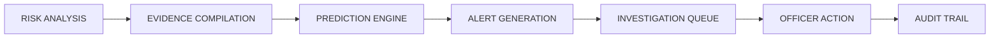

---

## Quick Links

| Resource | Link | Description |
| :--- | :--- | :--- |
| **Live Dashboard** | [mplads-ai.vercel.app](https://mplads-ai.vercel.app) | Interactive Government-Enterprise Web Application |
| **YouTube Demo Video** | [Watch Prototype Walkthrough](https://youtube.com/watch?v=your-demo-id) | Complete End-to-End System Demonstration |
| **MoSPI MPLADS Portal** | [mplads.gov.in](https://mplads.gov.in) | Official Government Source of Record |
| **eSAKSHI Portal** | [esakshi.mospi.gov.in](https://esakshi.mospi.gov.in) | Official Implementation Platform |

---

## Today's Reality & The Problem Statement

Thousands of MPLADS works nationwide are monitored via aggregated summaries, leaving authorities with delayed interventions and manual scanning burdens.

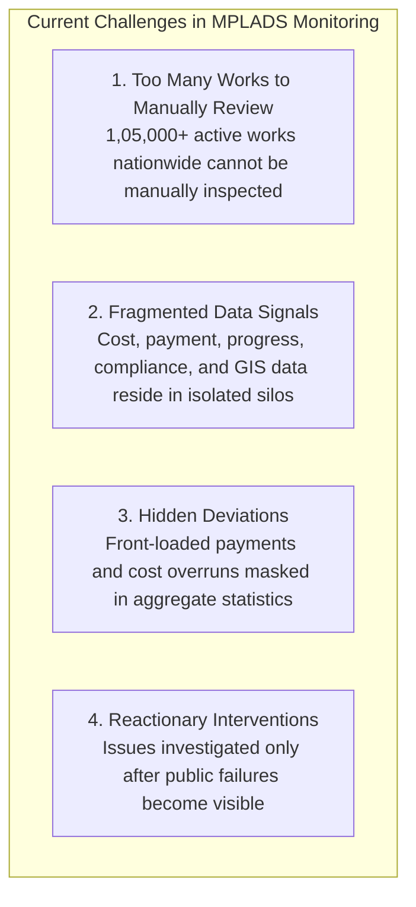

### Official Alignment
The official **eSAKSHI / MPLADS Portal** exposes work recommendations, expenditure, fund releases, status, and GIS locations. However, the **exact granularity of expenditure, milestone execution, and agency performance resides with District Authorities (Nodal Authorities)**. e-Sanchay synthesizes these distributed signals without disturbing current administrative workflows.

---

## The Solution: One Platform. One Prioritized Pipeline.

e-Sanchay shifts government oversight from **"Monitor Everything"** to **"Investigate What Matters"**.

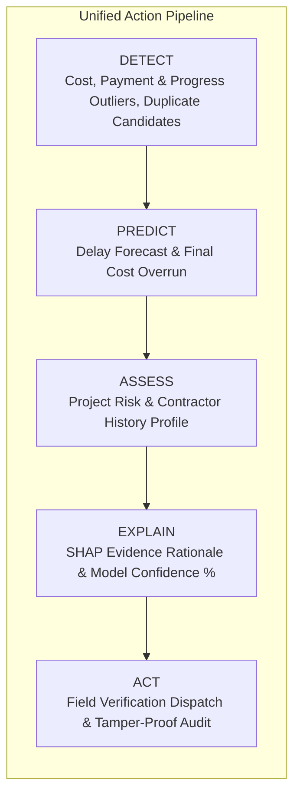

---

## Key Innovations & Game-Changers

### 1. Unified AI Risk Engine
Integrates financial velocity, physical progress, spatial similarity, documentation compliance, and historical contractor execution into a standardized **Unified Risk Index (0 - 100)**.

### 2. Contractor / Agency Risk Intelligence (Core Innovation)
Moves beyond isolated project checks. e-Sanchay constructs a persistent **Historical Risk Profile** per contractor/implementing agency across multiple works:
* Tracks recurring delay habits, systematic cost overruns, payment timing anomalies, duplicate relationships, and compliance certificate omissions.
* *Legal Defense Principle*: Always flagged as *"High-risk contractor — historical patterns require enhanced scrutiny,"* never automated accusation.

### 3. Predictive Monitoring
Forecasts project delays and probability of budget inflation **months before deadlines pass**, evaluating historical velocity vs physical progress curves.

### 4. Explainable AI (XAI with SHAP)
Eliminates black-box algorithms. Every flagged alert includes an explicit **"Why is this risky?"** panel displaying:
* Contributing risk weight percentages (e.g., Cost Deviation: +35%, Progress Lag: +28%).
* Quantitative evidence markers.
* Model confidence metrics (e.g., *89% Confidence*).

### 5. AI Decision-Support Copilot (Core Innovation)
An embedded natural language intelligence agent trained strictly on **MPLADS domain guidelines and live dataset context**:
* Officers ask natural language questions (e.g., *"Why is Project MPL-9281 critical?"*, *"Find potential duplicate works in Patna"*).
* Generates evidence-backed answers and formats formal **AI Investigation Reports** instantly.

### 6. Duplicate Work Intelligence
Combines **Sentence-BERT (S-BERT)** semantic description embeddings with **GIS spatial proximity (Haversine/PostGIS)** to highlight potential double-funding or duplicated work recommendations within a geographic radius (e.g., 93% description match, 1.4 km apart).

### 7. Priority Investigation Queue
Ranks all pending interventions by risk index, confidence, and financial exposure, ensuring district officers focus their limited field teams on top-tier anomalies first.

---

## Uniqueness & Strategic Value

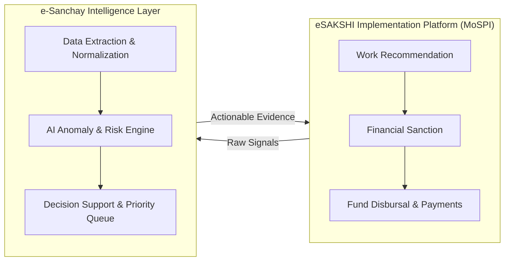

* **Complementary, Not Competitive**: eSAKSHI remains the official transaction platform for work recommendations and fund releases. e-Sanchay acts as an intelligent decision-support layer sitting on top of eSAKSHI data.
* **Contractor-Level Intelligence**: Identifies systemic risk patterns across all works awarded to a single contractor across districts.
* **Human-in-the-Loop Governance**: **AI flags, explains, and recommends**; **Authorized Government Officers verify, decide, and act**. AI is a decision support tool, NOT an autonomous agent.
* **Single Audit Trail**: Maintains end-to-end audit logs of every risk calculation, officer view, verification request, and report export for complete administrative accountability.

---

## 5 Levels of Intelligence Architecture

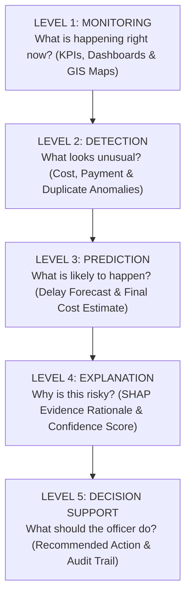

---

## Multi-Tier Stakeholder Personas

e-Sanchay natively maps onto the four operational tiers of the MPLADS governance structure:

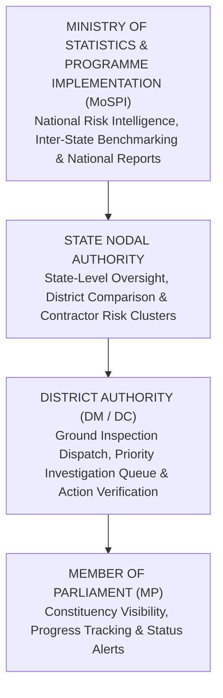

| Stakeholder Level | Key Dashboard Capabilities & Responsibilities |
| :--- | :--- |
| **Ministry (MoSPI)** | National Risk Index, inter-state progress comparison, macro anomaly detection, nationwide report generation. |
| **State Nodal Authority** | Inter-district benchmarking, contractor performance matrix, state compliance monitoring, high-risk project clusters. |
| **District Authority** | Prioritized investigation queue, physical vs financial verification, field inspection dispatch, official action logging. |
| **Member of Parliament** | Constituency-level visibility, recommended vs sanctioned vs completed progress, fund utilization tracking, status alerts. |

---

## System Workflow & Technical Architecture (Mermaid)

### End-to-End Technical & Data Architecture

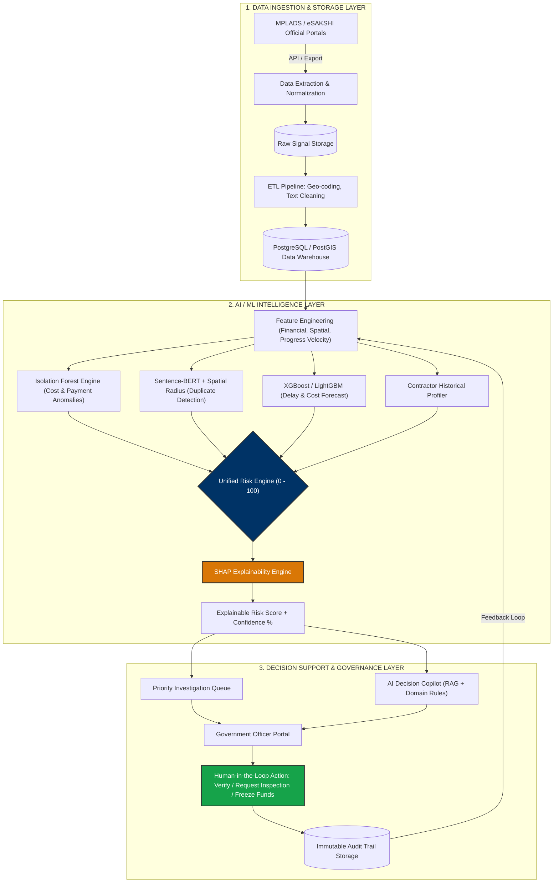

### Human-in-the-Loop Investigation Workflow

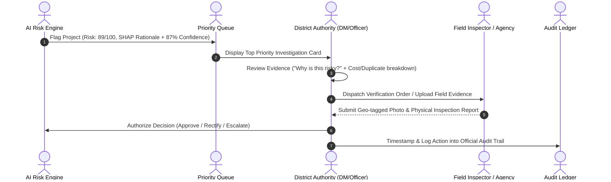

---

## Product Modules Roadmap

e-Sanchay is divided into 10 key enterprise modules:

| # | Module | Core Functionality & Deliverables |
| :---: | :--- | :--- |
| **1** | **Overview Dashboard** | National KPI cards, Fund vs Physical completion chart, Risk Distribution donut, State Risk Map, Live AI Insights. |
| **2** | **Risk Intelligence** | Filterable risk engine views, 4(+1) detection engines, unified scoring, confidence scores, contractor intelligence. |
| **3** | **Priority Investigation Queue** | Ranked investigation feed by risk level, financial value, issue type, and action urgency. |
| **4** | **Projects Directory** | Searchable project directory with status tags, financial utilization rates, risk badges, and district filters. |
| **5** | **Project Investigation (Hero Screen)** | Deep-dive screen displaying Identity, Budget vs Benchmark, Timeline predictions, Duplicate side-by-side comparison, Compliance checklist, and Recommended Action. |
| **6** | **Financials Module** | Allocation vs Release vs Expenditure analysis, fund utilization speed, payment anomaly flags, district cost benchmarking. |
| **7** | **Compliance Tracker** | Approval-to-Completion tracking (AS, TS, FS, UC, Completion Certs, Geo-tagged photos) rolled into a Compliance Score. |
| **8** | **Auto-Generated Reports** | One-click PDF/Excel export of National Risk Intelligence, State Cost Benchmarking, Duplicate Registers, and Delay Forecasts. |
| **9** | **AI Copilot** | Natural-language decision support drawer with domain context, pre-built query chips, and auto-generated investigation reports. |
| **10** | **Audit Trail & RBAC** | Role-based navigation (Ministry, State, District, MP) and immutable logging of every risk assessment and officer action. |

---

## Unified Risk Scoring System

All signals culminate in a standardized risk scale:

```
[Level: LOW]        Score: 0 - 30      Normal progress, routine monitoring
[Level: MEDIUM]     Score: 31 - 50     Minor delay / documentation gap
[Level: HIGH]       Score: 51 - 70     Cost deviation / Payment anomaly detected
[Level: CRITICAL]   Score: 71 - 100    High probability delay / Duplicate work candidate / Contractor pattern
```

> **AI Confidence Score (%)**: Displayed alongside every score to explicitly communicate model certainty (e.g., *Risk 84/100 · 92% Confidence*).

---

## Feasibility & Risk Mitigation Matrix

### Feasibility & Mitigations Diagram

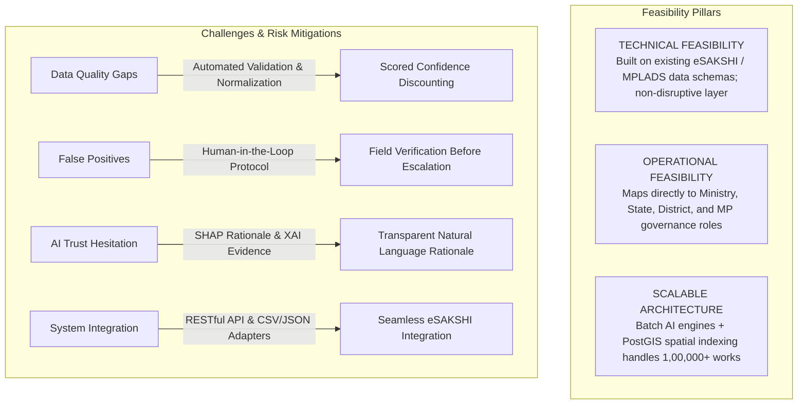

---

## Tangible Benefits

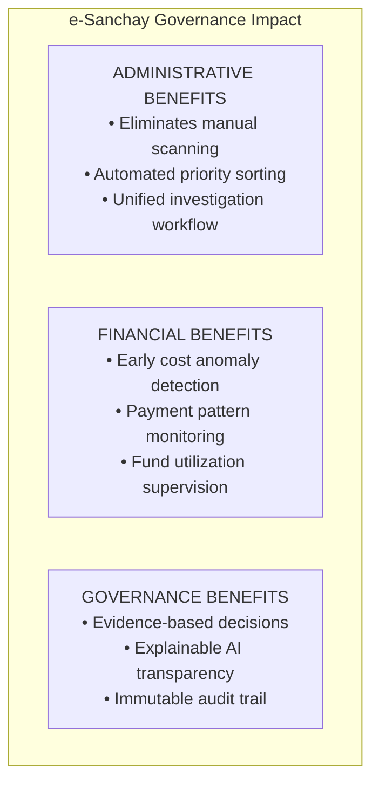

---

## Tech Stack & Technical Research Foundation

### Application Technology Stack

| Layer | Technologies Used |
| :--- | :--- |
| **Frontend Framework** | React 18 (TypeScript), Vite 6 |
| **Styling & UI** | Tailwind CSS v3, Lucide React (Enterprise Outline Icons), Custom CSS Design System |
| **Data Visualization** | Recharts (Financials & Progress trends), Custom SVG Risk Gauges |
| **GIS & Mapping** | Leaflet / D3-Geo (Interactive India State & District Risk Maps) |
| **Routing & State** | React Router v6 |
| **AI Backend (Engine)** | Python 3.11, FastAPI / PyTorch / Scikit-Learn |
| **Database & Search** | PostgreSQL 16 + PostGIS (Spatial Analysis), Vector Indexing |

### Scientific & Research Citations

1. **Anomaly Detection**: *Isolation Forest* (Liu, Ting & Zhou - IEEE). Research basis for detecting multi-dimensional financial & progress outliers in large public datasets.
2. **Explainable AI (XAI)**: *SHAP (SHapley Additive exPlanations)* (Lundberg & Lee - NeurIPS 2017). Framework used for assigning exact quantitative attribution weights to risk factors.
3. **Semantic Similarity**: *Sentence-BERT (S-BERT)* (Reimers & Gurevych - arXiv). Technical foundation for semantic similarity matching of project titles and work descriptions across nearby coordinates.

---

## Project Directory Structure

```
mplads-ai/
├── public/
│   ├── .htaccess
│   └── _redirects
├── src/
│   ├── components/
│   │   ├── common/             # Reusable UI cards, metrics, badges & tables
│   │   ├── copilot/            # AI Copilot Drawer, chat input & sample queries
│   │   ├── dashboard/          # KPI cards, charts, risk maps & early warnings
│   │   ├── layout/             # Sidebar, TopHeader & navigation elements
│   │   ├── project/            # Project investigation components & compliance lists
│   │   └── risk/               # Risk intelligence filtering & scoring engines
│   ├── data/
│   │   └── dashboardData.ts    # Realistic Mock MPLADS Data, Risk Scores & Insights
│   ├── pages/
│   │   ├── CompliancePage.tsx
│   │   ├── DashboardOverviewPage.tsx
│   │   ├── FinancialsPage.tsx
│   │   ├── NotFoundPage.tsx
│   │   ├── ProjectDetailPage.tsx  # Hero Project Investigation Screen
│   │   ├── ProjectsPage.tsx
│   │   ├── ReportsPage.tsx
│   │   └── RiskIntelligencePage.tsx
│   ├── types/                  # TypeScript Data Schemas & API Contracts
│   ├── utils/                  # Formatting, Geo-calculations & Risk Helpers
│   ├── App.tsx                 # Core Route Configuration & Layout Shell
│   ├── main.tsx                # Entry point
│   └── index.css               # Design Tokens & Utilities
├── package.json
├── postcss.config.js
├── tailwind.config.js
├── tsconfig.json
├── vercel.json
└── vite.config.ts
```

---

## Local Setup & Installation

### Prerequisites
* **Node.js**: v18.0.0 or higher
* **npm**: v9.0.0 or higher

### Steps

1. **Clone the Repository**
   ```bash
   git clone https://github.com/prince7z/MPLads.git
   cd MPLads
   ```

2. **Install Dependencies**
   ```bash
   npm install
   ```

3. **Start Local Development Server**
   ```bash
   npm run dev
   ```
   Open your browser and navigate to `http://localhost:5173`

4. **Build for Production**
   ```bash
   npm run build
   ```

5. **Preview Production Build**
   ```bash
   npm run preview
   ```

---

## Summary Demo Walkthrough

When presenting e-Sanchay / MPLADS AI, follow this recommended presentation sequence:

```mermaid
flowchart LR
    D1["1,05,642 Active Works"] --> D2["Overview Dashboard"]
    D2 --> D3["Filter Critical/High Risk"]
    D3 --> D4["Select High-Risk Project"]
    D4 --> D5["Inspect Risk Score (89/100)"]
    D5 --> D6["Review Why Is This Risky (SHAP Factors)"]
    D6 --> D7["Verify Delay/Cost Forecast & GIS Duplicate Match"]
    D7 --> D8["Execute Recommended Action & Generate AI Report"]
    D8 --> D9["Timestamp Action in Audit Ledger"]
```

---

## Acknowledgements & References

* **Ministry of Statistics and Programme Implementation (MoSPI)**: Guidelines on Members of Parliament Local Area Development Scheme (MPLADS).
* **Official Portals**: [MPLADS DigiGov Portal](https://mplads.gov.in) & [eSAKSHI Portal](https://esakshi.mospi.gov.in).
* **Smart India Hackathon (SIH 2026)**: Developed as a comprehensive product specification and prototype for national implementation monitoring.

---

<div align="center">
  <sub>Built for Transparent, Efficient, and Accountable Public Governance in India.</sub>
</div>
